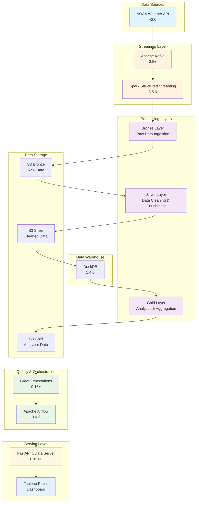

# Weather Data Engineering Pipeline

A comprehensive real-time weather data engineering pipeline that crawls NOAA weather data for specific locations and serves it to interactive dashboards via a modern data lakehouse architecture.

## Project Overview

This project implements a complete **real-time weather data pipeline** that:
- **Crawls** weather data from NOAA APIs for specified locations
- **Streams** data through Kafka for real-time processing
- **Processes** data through Bronze → Silver → Gold layers using Spark and dbt
- **Validates** data quality with Great Expectations
- **Orchestrates** the entire pipeline with Apache Airflow
- **Serves** validated data to Tableau Public dashboards via OData API

## Tech Stack & Architecture

### Data Flow Architecture
```
NOAA API → Kafka → Spark Streaming (Bronze) → Spark Batch (Silver) → dbt (Gold) → Great Expectations (Validation) → Airflow (Orchestration) → OData API → Tableau Public Dashboard
```

### Technology Stack

| Component | Technology | Version | Purpose |
|-----------|------------|---------|---------|
| **Data Source** | NOAA Weather API | v2.0 | Weather data extraction |
| **Message Queue** | Apache Kafka | 3.5+ | Real-time data streaming |
| **Stream Processing** | Apache Spark Structured Streaming | 3.5.0 | Bronze layer real-time processing |
| **Batch Processing** | Apache Spark | 3.5.0 | Silver layer data cleaning & enrichment |
| **Data Warehouse** | DuckDB | 1.4.0 | Gold layer analytics & aggregation |
| **Data Modeling** | dbt | 1.7+ | Gold layer transformations |
| **Data Validation** | Great Expectations | 0.18+ | Data quality validation |
| **Orchestration** | Apache Airflow | 3.0.2 | Pipeline orchestration & scheduling |
| **Storage** | Amazon S3 | - | Data lake storage with partitioning |
| **API Server** | FastAPI | 0.104+ | OData API for dashboard connectivity |
| **Dashboard** | Tableau Public | - | Interactive data visualization |
| **Language** | Python | 3.12 | Primary development language |
| **Language** | Scala | 2.13 | Spark transformations |
| **Build Tool** | sbt | 1.9+ | Scala project management |

### Architecture Diagram



## Quick Start

### Prerequisites
- **Python 3.12.** (Primary language)
- **Scala 2.13.16** (Spark transformations)
- **Java 17.0.16** (Spark runtime)
- **sbt 1.11.4** (Spark compiler)
- **Apache Kafka 4.0.0** (Message streaming)
- **Apache Spark 4.0.0** (Data processing)
- **DuckDB 1.4.0** (Data warehouse)
- **dbt 1.7.0** (Data modeling)
- **Apache Airflow 3.0.2** (Orchestration)
- **AWS CLI 2.31.4** configured
- **Tableau Public** (Dashboard)

### 1. Install Dependencies
```bash
# Python dependencies
pip install -r requirements.txt

# Scala dependencies (sbt will handle)
sbt compile
```

### 2. Configure Environment
```bash
cp env.example .env
# Edit .env with your AWS credentials and configuration
```

### 3. Run Complete Pipeline
```bash
# Start Kafka (if not running)
kafka-server-start.sh config/server.properties

# Run Airflow DAG (orchestrates entire pipeline)
airflow dags trigger weather_data_pipeline

# Or run components individually:
# Bronze Layer (Spark Streaming)
./run_transform.sh bronze weather-forecast noaa s3://data-eng-bucket-345/bronze/weather

# Silver Layer (Spark Batch)
./run_transform.sh silver weather-forecast noaa s3://data-eng-bucket-345/bronze/weather s3://data-eng-bucket-345/silver/weather

# Gold Layer (dbt)
dbt run -s gold.weather_metrics

# Data Validation (Great Expectations)
python great_expectations/weather_data_suite.py

# Serve data via OData API
python simple_secure_s3_odata_server.py
```

## Data Pipeline Components

### 1. Data Ingestion (`src/crawler/`)
- **NOAA Weather API crawler** - Extracts weather data for specified locations
- **Kafka producer** - Streams data to Kafka topics
- **Rate limiting** - Handles API constraints and backpressure

### 2. Streaming Layer (`src/main/scala/`)
- **Apache Kafka** - Message queue for real-time data streaming
- **Spark Structured Streaming** - Bronze layer real-time processing
- **Delta Lake** - ACID transactions and schema evolution

### 3. Batch Processing (`src/main/scala/batch/`)
- **Spark Batch Jobs** - Silver layer data cleaning and enrichment
- **Data quality scoring** - Automated validation and scoring
- **Deduplication** - Removes duplicate records based on business keys

### 4. Data Warehouse (`models/`)
- **DuckDB** - High-performance analytical database
- **dbt models** - Gold layer transformations and aggregations
- **Incremental processing** - Efficient handling of new data

### 5. Data Validation (`great_expectations/`)
- **Great Expectations suite** - Comprehensive data quality validation
- **S3 integration** - Validates data at rest
- **Automated reporting** - Quality metrics and alerts

### 6. Orchestration (`dags/`)
- **Apache Airflow** - Pipeline orchestration and scheduling
- **DAG workflows** - Coordinated execution of pipeline stages
- **Error handling** - Retry logic and failure notifications

### 7. Data Serving (`simple_secure_s3_odata_server.py`)
- **FastAPI OData server** - RESTful API for dashboard connectivity
- **Tableau Public integration** - Direct dashboard connectivity
- **Security features** - Authentication and input validation

## S3 OData Server for Tableau Public

A minimal FastAPI server that serves S3 data via OData endpoints for Tableau Public connectivity.

### Quick Start

#### 1. Set Environment Variables
```bash
export S3_BUCKET=your-bucket-name
export ODATA_USERNAME=your-username
export ODATA_PASSWORD=your-password
export ODATA_HOST=localhost
export ODATA_PORT=8000
```

#### 2. Install Dependencies
```bash
pip install fastapi uvicorn boto3 pandas python-dotenv passlib[bcrypt]
```

#### 3. Run Server
```bash
python3 simple_secure_s3_odata_server.py
```

#### 4. Set Up Cloudflare Tunnel
```bash
# Install cloudflared
curl -L --output cloudflared.deb https://github.com/cloudflare/cloudflared/releases/latest/download/cloudflared-linux-amd64.deb
sudo dpkg -i cloudflared.deb

# Create tunnel
cloudflared tunnel --url http://localhost:8000
```

#### 5. Connect from Tableau Public
1. Open Tableau Public
2. Connect to Data → More Servers → OData
3. URL: Use the Cloudflare tunnel URL (e.g., `https://abc123.trycloudflare.com`)
4. Username/Password: Your configured credentials

### OData Endpoints

- `/` - OData Service Document
- `/$metadata` - OData Metadata Document  
- `/weather_data` - Weather data entity set
- `/health` - Health check

### Data Structure

The server automatically reads from `gold/weather/processed/` in your S3 bucket and combines all parquet files into a single dataset with partition columns (`year`, `month`, `day`).

### Security Features

- HTTP Basic Authentication
- IP-based lockout after 5 failed attempts
- Input validation and sanitization
- CORS restricted to Tableau Public only
- Row limits (10,000 per partition file)

### Troubleshooting

#### Service Document Empty
```bash
# Check S3 access
aws s3 ls s3://your-bucket-name/gold/weather/processed/ --recursive | head -5

# Check server logs
python3 simple_secure_s3_odata_server.py
```

#### Cloudflare Tunnel Issues
```bash
# Test local server
curl http://localhost:8000/health

# Test tunnel
curl https://your-tunnel-url.trycloudflare.com/health
```

#### Tableau Connection Issues
- Ensure HTTPS URL (Cloudflare tunnel provides this)
- Check credentials are correct
- Verify server is running and accessible

## Project Structure

```
├── src/                    # Source code
│   ├── crawler/           # Data extraction
│   ├── main/              # Main processing logic
│   └── utils.py           # Utility functions
├── great_expectations/    # Data validation
├── models/                # dbt models
│   ├── silver/           # Silver layer
│   └── gold/             # Gold layer
├── data/                 # Data storage
│   └── raw/             # Raw data
├── scripts/             # Automation scripts
├── tests/               # Test files
└── simple_secure_s3_odata_server.py  # OData API server
```

## Configuration

### Environment Variables
- `S3_BUCKET`: S3 bucket name
- `ODATA_USERNAME`: OData server username
- `ODATA_PASSWORD`: OData server password
- `AWS_ACCESS_KEY_ID`: AWS access key
- `AWS_SECRET_ACCESS_KEY`: AWS secret key
- `AWS_DEFAULT_REGION`: AWS region

### dbt Configuration
- `profiles.yml`: dbt connection profiles
- `dbt_project.yml`: dbt project configuration

## Monitoring and Maintenance

### Data Quality
- Great Expectations validation reports
- dbt test results
- S3 data freshness checks

### Performance
- S3 storage optimization
- Query performance monitoring
- API response times

### Security
- AWS IAM role management
- API authentication logs
- Data access auditing

## Contributing

1. Fork the repository
2. Create a feature branch
3. Make your changes
4. Add tests if applicable
5. Submit a pull request

## License

This project is licensed under the MIT License.